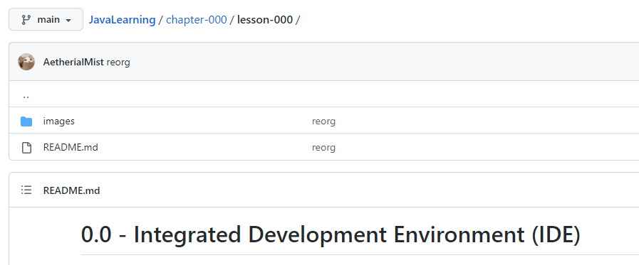

# 0.0 - Integrated Development Environment (IDE)

## Terminology

You will encounter a lot of new words and phrases throughout this guide. Usually the first time unfamiliar terminology
is used, there will be a nice hyperlink to the [terminology](../../terminology.md) page. You can always go back to this
page if you forget what a word or phrase is about. There is also every programmer's best friend
[Google](https://google.com) you can utilize!

There will also be a lot of new acronyms, multiple words shorted to just a few capital letters, in this guide. Acronyms
have a special section in the [terminology](../../terminology.md) page.

Throughout the guide I will also use "lesson" and "section" interchangeably. 

## Conversation

I will occasionally have a conversation pretending to be you talking to me. I promise I'm not crazy, at least not in my
opinion.

> _When I pretend to be you, asking a question or complaining about something, it will appear like this!_

And I will usually put my response to _your_ question or statement right below.

## Traversing This Guide

As you probably already know, this guide is on GitHub. We will have a future lesson about how to use Git and GitHub
(they are not the same thing!) for your own projects.

GitHub provides a nice way to view projects. When looking at a folder, if the folder contains a `README.md` file, 
then GitHub will show the contents of that file in a nicely formatted view (what you are reading right now!). You 
can also open the `README.md` file directly, but there is not much reason to do that.

Near the top of this webpage, you should see something very similar to:



### Breadcrumbs

_Don't click on the image above. The breadcrumbs in the image will not work._

While looking at the various folders and files in this project, GitHub provides **_breadcrumbs_** near the top. On 
this page, they are:

`JavaLearning / chapter-000 / lesson-000 /`

The breadcrumbs contain an ordered list of items separated by a single forward slash `/`. Each item, except for the 
last one (the far right) is a folder. The last item can be either a folder or an individual file.
The last item is also what you are currently looking at; in this case: `lesson-000`.

You can click the hyperlinks in the breadcrumbs to "go back" to the folders containing the current folders and files.
So `left-clicking` on `chapter-000` will take you back to the "Chapter 0 - Setup" page you likely saw before this page.
And the `JavaLearning` link will take you all the way back to the very start.

### Last commit

This is the next line under the breadcrumbs. It shows who the last person to edit this folder or file was, and a 
little message to go with their change. For the most part, you can just ignore this line.

### Sub-Folders and Files

Right below the last commit line, are the sub-folder, files, and "go back" link. In the picture above, there are 
only three things:

1. The "go back" sub-folder. This will take you to the previous breadcrumb we explained earlier; in this case 
   `chapter-000`.
2. `images` sub-folder. This is where I put images in each lesson, I could put other things in there though. The 
   names of folders and files are mostly meaningless (there are a few exceptions).
3. `README.md` what you are reading right now. As mentioned earlier, if a folder contains this specially named file, 
   then GitHub shows it while viewing the folder it is in. This filename is one of the exceptions previously mentioned.

Later lessons may have more sub-folders and files in them. You can click on them in this top section to open those 
folders and files. Just remember you have those breadcrumbs at the top to get back!

### README.md

I think I have explained this enough already, it is what you are currently reading and is a file within this folder.

## Getting Started

Sure you could write raw Java files using Microsoft Notepad, but you will not be able to run the code unless you install
Java onto your computer. So let us install Java to get started.

### Install Java

#### Windows and Mac Users

1. Go to [Adoptium's Website](https://adoptium.net/) and download the "Latest [LTS](../../terminology.md) Release"
   installer for your Operating System ([OS](../../terminology.md)).
    * What is Adoptium? It is an [open-source](../../terminology.md) implementation of Java.
    * Why use Adoptium? Because it is free and widely used by the Java community. Otherwise, you have to pay money to
      Oracle, and nobody wants to do that when there is a perfectly good, free version available.
2. Run the downloaded installer. You should be fine to accept all the defaults.
    * Be careful of any [bloat-ware](../../terminology.md), and make sure to uncheck it!
        * Usually asks questions such as: "Would you also like to install this other software while we install what you
          actually want?"
    * **Pay attention to _where_ Java is being installed**, as you may need this information later.
        * On Windows, it should install somewhere like `C:\Program Files\Eclipse Adoptium\jdk-VERSION-hotspot`

#### Linux Users

1. Run the following commands in a terminal:
   ```bash
   $ sudo apt update
   $ sudo apt install openjdk-17-jdk
   # Verify using:
   $ java -version
   ```

---

> _Why do I need to install Java, I thought it was a programming language, used to write fancy text files?_

Well yes, kind of. What you are installing is called the [Java Virtual Machine](../../terminology.md) (JVM). The JVM is
what actually runs your code; there are some steps in-between, but we will cover that much later. On top of that, you
are downloading the Java core library. Java contains a massive [library](../../terminology.md) of code that you use to
create your code. Trust me, you do _not_ want to start from the very bottom.

As of writing this guide, Java 17 is the latest LTS version. So this guide will assume _at least_ the capabilities of
version 17. When newer LTS versions are released, they generally only **add** more functionality to the language, rarely
are features ever changed significantly or removed.

### Java has been installed!

> _Java is installed, now I can program right?!_

If you like suffering, sure. If you have even a shred of dignity, you will also want to install
an [Integrated Development Environment](../../terminology.md) (IDE). Think of this as software that helps you write
software. Java text files are exactly just that, text files. They sure are human-readable (hopefully), but the JVM that
actually runs your code, has absolutely no _idea_ (future pun incoming) what to do with them.

You have to [compile](../../terminology.md) (transform) your text files into special files called "Java
[byte-code](../../terminology.md)" that the JVM understands, and are most definitely not human-readable. We will actually
take a quick look at Java byte-code later, so you can see how unreadable it really is.

Installing Java on your computer gives you the ability to run the `javac` command on a terminal; "javac" simply means 
"Java compile" followed by your program files. If anyone ever tells you to compile your code manually using
`javac`, never speak to them again, seriously. Any sane person will use an IDE to write their program and then make the
IDE compile the code for them. For this reason, I am not going to explain how to use `javac`.

There are many _flavors_ (options) of IDEs out there that can be used for Java programming: Visual Studio Code,
NetBeans, Eclipse, etc. The one this guide uses, and one of the most popular by far, is called Intellij IDEA
(there's the pun).

### Install Intellij IDEA

1. Go to the [Jetbrains IDEA Website](https://www.jetbrains.com/idea/download/).
2. Download the "Community" version.
    * The only real reason to get Ultimate is for Spring support (a [framework](../../terminology.md) built on Java), which
      will be in optional lessons much, much, much later on.
    * Again, you should be fine using all the default installation options, be ever vigilant watching for bloat-ware.

### Intellij IDEA has been installed!

> _Now can I finally write a program?_

Yes! But not in this lesson.

## Recap

In this lesson, you:

* Installed the Java Virtual Machine (JVM)
* Installed the Java core library
* Installed Intellij IDEA as your IDE

## Next Steps

This was mostly boring, but is required to continue.

[Next](../../chapter-001/lesson-000)
