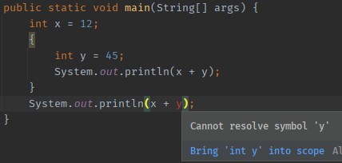
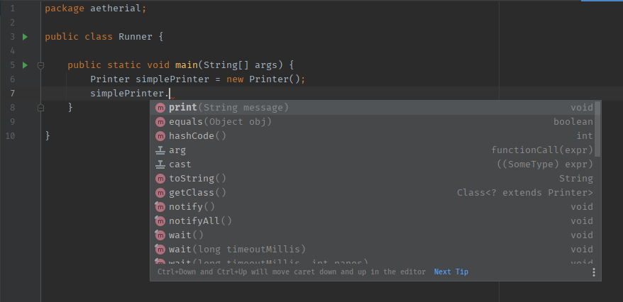

# Lesson 7 - Intro to Methods, Classes, and Objects

## Scope - Part 1

Remember that talk about how every open curly brace `{` needs a buddy closing curly brace `}`? These braces define
**_scope_**. Code inside a pair of curly braces, can access code from outer pairs, but can not access code inside inner
pairs. It's okay if you have to read that previous sentence a few times, and it is also okay if that doesn't make total
sense yet. Let's show an example using variables!

```java
package aetherial;

public class Scope {

    public static void main(String[] args) { // Outer
        int x = 12;
        { // Inner
            int y = 45;
            // Can see the variable `x` from the outer scope
            System.out.println(x + y); // Inner print statement
        }
        // Can NOT see the variable 'y' from the inner scope
        // Intellij will warn us by highlighting 'y' red
        System.out.println(x + y); // Outer print statement
    }

}
```

You can see that we have an inner pair of curly braces inside our special entry point
`public static void main(String[] args) { }` curly braces.

* The first print statement, inside the inner braces, will work as expected. Inner scopes can see variables from outer
  scopes.
* The second print statement, outside the inner braces, will cause an error in our program. Outer scopes can **NOT**
  see variables from inner scopes. This second print statement has no idea that the variable `y` was ever declared!

Below we can see the error Intellij shows us:



### Real Life Example of Scope

One way to demonstrate this in real life, is to find a building with heavily tinted windows or one-way glass. The
outside world is the "outer scope", and inside the building is the "inner scope". People inside the building can look
out into the world and see what the weather is, and the people outside definitely know what the weather is like.

But the people outside have no idea what is happening inside the building! The people outside can't see inside the
building, or know that someone turned the air conditioning all the way up so the penguins visiting from the local zoo
are comfortable. In fact, the people outside don't even know that penguins are roaming freely around the inside of that
building!

This is similar to what is happening in Java. Inner scopes know everything the outer scopes know, but outer scopes do
not know what is happening inside inner scopes.

### Fixing the Example

We can fix the above program by simply declaring `y` in the outer scope like so:

```java
package aetherial;

public class Scope {

    public static void main(String[] args) { // Outer
        int x = 12;
        int y;
        { // Inner
            y = 45;
            System.out.println(x + y);
        }
        System.out.println(x + y);
    }

}
```

This way, both the outer and inner scopes know that `y` exists! We can even see that the changes to `y` the inner scope
made, affected the outer scope.

## Methods

So far, we have only made a single `class` file. Inside this `class`, we create the special
`public static void main(String[] args)` line, and put all our code inside those curly braces. But what really is
this `public static void main(String[] args)` nonsense?

As we covered all the way back in lesson 1, this special line is the entry point to the entire program. All Java
programs have exactly `1` of these lines (libraries have `0`!).

This line, combined with a scope `{` and `}`, is called a **_method_**. For this reason, our special line is often
called the "main method" of a Java program (programmers are very creative people).

Now we are going to break down this main method even further!

### main(String[] args)

This is really two parts:

* `main` is the name for this method.
* `(String[] args)` are the arguments, also called parameters, for this method.

> _Argu-what? What does that mean?_

"Arguments" are the information you must give to the method. We will see some examples soon! This is one of the ways for
how we pass variables around in Java. You can think of this as input to the method. If a method has no arguments, we use
an empty set of parenthesis `()`.

### void

All methods must define their **_return type_**. You already know what "type" means (yay!), and if arguments are
considered the input of a method, the "return type" is the type of output for the method. All Java types and Java
primitive types can be used here; `void` is special, because it means there is no output for the method, _nothing_
will be returned!

### static

This one tends to cause a lot of trouble for people first learning Java. `static` means you can use this method from a
"static context". And "static context" means that you can use the method by simply using the `class` name, followed
by `.` and the method name. We will demonstrate this shortly. This label is optional, and we will explain the
differences soon.

> _"use this method", what do you mean?_

We are getting there, hold tight!

### public

This is how we define the scope of the entire method itself, within the `class`. There are few other options we can use
instead of `public`, but for now we are only going to use `public`. And what `public` means, is that other `class`s can
see and use this method too.

### Method Signature

Putting all the above pieces together, we get what is called a **_method signature_**. You can think of this as a
contract.

#### Real Life Example

Let us say you want to print an essay for school, using the printer at the library. This pretend library does not
provide paper for you to use, so you have to bring your own. You go to one of the computers, open up your essay, and
send it to the printer to be printed.

The printer requires that you give it paper, in order to print. This paper is the argument (input) to a method. The
printer then takes the paper you input, and prints (outputs) your essay!

From this example, we could say that the method signature is:

```java
public Essay print(Paper blankPaper)
```

Notice how I did not include `static`. This is because you need to have access to a `Printer` in order to print. You
can't just print from thin air! This is another way to think about the `static` keyword; you can use these methods
from "thin air".

## Classes

`class` files define a _template_ for a type, where the name of the type is the name of the `class`.

> _Wait, does this mean our class files with the main method have been types this whole time?_

Correct! We just never used our `class` file as a type, since we were only using the main method (which must exist in
a `class` file). We are finally going to create more than one `class` file!

### Create a New Example

1. Name this project "MyFirstType", and this time name the starting class "Runner".

```java
package aetherial;

public class Runner {

    public static void main(String[] args) {

    }

}
```

2. Now create a second `class` in the same package named "Printer".

```java
package aetherial;

public class Printer {

}
```

3. Now add a method with a signature of `public void print(String message)` to `Printer`

```java
package aetherial;

public class Printer {

    public void print(String message) {

    }

}
```

4. Inside this method, we are going to do something you are a total pro at: `System.out.println(message);`

```java
package aetherial;

public class Printer {

    public void print(String message) {
        System.out.println(message);
    }

}
```

### Constructors

Up until now, we have only used Java primitive types, where we can just use _literal_ values, like: `4`, `'A'`, `12. 5`,
and we even get to treat `String` like a primitive type using double quotes `"Hello"`. Non-primitive types require the
use of a special method called a **_constructor_**. This method has no return type, and the name of the method is the
same as the `class` name.

Java will create a _default constructor_ for you if you do not create on yourself for `class` files. But for
demonstration we will create the default constructor manually, and add a print statement inside. Later we will create
constructors that take in arguments.

```java
package aetherial;

public class Printer {

    public Printer() {
        System.out.println("You created a Printer!");
    }

    public void print(String message) {
        System.out.println(message);
    }

}
```

> _You said method names follow camelCase capitalization!_

Constructors are an exception to that rule! Because the method name has to be identical to the name of the `class`.

### The `new` Keyword

There is about to be a lot of new vocab, so prepare yourself!

Java primitives let us set variables using the literal values, like `int x = 5;`. For non-primitive types, we have 
to use the `new` keyword and a constructor of the type.

For our `Printer` `class`, we create "new" `Printer`s like so:

```java
package aetherial;

public class Runner {

    public static void main(String[] args) {
        Printer simplePrinter = new Printer();
    }

}
```

`Printer simplePrinter = new Printer();` follows our standard format of `TYPE VARIABLE_NAME = VALUE;`. I chose the 
variable name to be `simplePrinter`, but just like all of our other variables, the variable name is just a name; we 
can use almost anything we want.

This process of calling a constructor is called **_instantiation_**, and the result is an **_instance_** of the type.
Instances are unique, and we will demonstrate this soon. An _instance_ of a `class` is also known as an **_Object_**,
and we will explain why in a latter lesson.

Go ahead and run your program as it is! Your output should look like:

```text
You created a Printer!
```

We can see that our constructor method with no arguments was called! Constructors are just methods, so anything you 
can do in a method, you can do in a constructor. If you recall, `main` is also a method, and where we have been 
writing our entire programs so far. We could easily just move all our program logic into the constructor of a 
`class`, and it will work exactly the same.

### Calling a Method

Now that we have our _instance_ of a `Printer` type, we can use its methods!

Intellij IDEA has a special tool built in called "intellisense" (a term not owned by Intellij). You've probably 
already noticed it by now with auto-completion suggestions. Intellisense also works for viewing all the methods we 
can use on an _instance_ or variable. Primitive types do not have methods, which is why we never bothered with 
methods before now.

When you type the variable name followed by a period `.`, intellisense will activate and show you all the methods 
available!



Intellisense is only something you will get if you are using an IDE like Intellij IDEA; yet another reason to use an 
IDE!

In the picture above:

* the name of the method is on the very left
* arguments (if any) are directly after the name, in a light gray color.
  * If no arguments are necessary, you will see `()` at the end.
  * If arguments are necessary, Intellij will tell you with the type and the name the method will use for the argument.
    * The name of your variable passed as an arguments does **NOT** need to match the argument's label!
* The _return type_ of the method is on the very right.

We can see the _print_ method we created earlier is shown by intellisense! Our method signature of 
`public void print(String message)` looks fairly similar to what intellisense is showing. It is worth mentioning 
that most IDEs have their own unique way of displaying intellisense.

In case you haven't tested auto-completion on your own yet, we can use the `up` and `down` arrow keys on the 
keyboard, or the mouse cursor, to highlight the suggestion we want, and then press `ENTER`, `TAB`, or `left-click`,
to make Intellij type the rest for us. Then we just have to fill in the arguments manually.

```java
package aetherial;

public class Runner {

    public static void main(String[] args) {
        Printer simplePrinter = new Printer();
        simplePrinter.print("Hello, world!");
    }

}
```

And if we run this program our output will look like:

```text
You created a Printer!
Hello, world!
```

## Next Steps

[Completed Code](completed)

[Previous](../lesson-005) | [Next](../lesson-007)