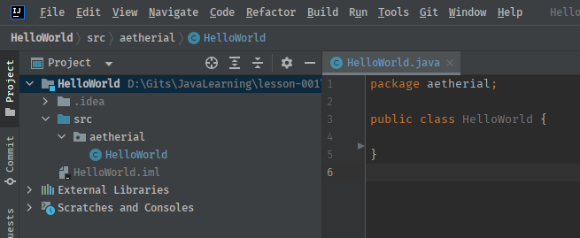

# Lesson 1 - Hello World

|      Previous Lesson      |        Next Lesson         |
|:-------------------------:|:--------------------------:|
| [Lesson 0](../lesson-000) | [Lesson 2](../lesson-002)  |

## Projects Folder

_yes, plural_

This guide assumes you know how to create folders, or directories, on your computer. If you don't, please meet every
programmer's best friend [Google](https://google.com).

The first thing you need to do is create a single, dedicated folder for all your projects. This way, all the projects
are in the same relative space and easy to find. If you scatter projects all over your computer, your future self will
be very upset with current you. Below are some recommendations on where to create this folder and what to name it:

* Windows: `C:\Users\YOUR_USER\Documents\JavaProjects`
    1. Assuming you are logged in as you (why wouldn't you be?), Open `File Explorer`
    2. Go to your `Documents` folder
    3. Create a new folder called "JavaProjects"
* Linux: `~/javaprojects`
    1. Open a terminal
    2. Run:
       ```bash
       $ mkdir ~/javaprojects
       ```
* Mac: `/Users/YOUR_USER/Documents/JavaProjects`
    1. Open `Finder`
    2. Browse to your `Documents` folder
    3. Create a new folder called "JavaProjects"

Feel free to put this folder where you want, as long as you remember where. Eventually, you will likely end up with
dozens, if not hundreds, of sub-folders inside this projects-folder.

## Create a New Intellij Project

1. Open Intellij Idea
2. Select: `File -> New -> Project...`
    * If no open projects are cached, you may have a special starting menu with a `New Project` button or something
      similar.
3. Name this project: "HelloWorld"
    * Make sure there are no spaces!
4. Make sure the `Location` is inside your projects-folder created earlier.
    * For Windows and Mac users, the start may be replaced with `~\Documents\`, and that is okay.
5. Make sure the `Language` selected is `Java`.
6. For the `Build System`: select `Intellij`
    * We will eventually explain build systems in more detail later, at which point we will switch to using `Maven`.
7. For `JDK`: select Java 17 from the dropdown
    * May show as just "`17`"
    * You may need to select `Add JDK...` and browse to the Java 17 install location that you were told to write down
      earlier.
        * Probable Windows Location: `C:\Program Files\Eclipse Adoptium\jdk-VERSION-hotspot`
8. Click `Create` at the bottom right.


### Empty Project

After the project is created, you should have an empty project window opened that will looks something like this:


_If you look really close, you may notice I actually created my version of this project in the same lesson folder as
this! You can ignore this slight difference._

### Project Window Breakdown

Let's break down some of the basics of an Intellij IDEA project window.

1. Left sidebar
    * This is where you can view your project's structure; most of the time will just be folders and files.
    * You should see a Folder called "HelloWorld" near the top of this sidebar, with some sub-folders and files. Let's
      break this down even further:
        1. The `.idea` folder: This folder contains [metadata](../terminology.md) about your project specific to
           Intellij so that it knows this is a Java project, and some additional information about the structure. You
           can ignore this folder, it is only for Intellij to use.
        2. The `src` folder: This is where you put your actual code. Only code inside this folder will be
           [compiled](../terminology.md).
        3. The `HelloWorld.iml` file: This is more metadata for Intellij, you can ignore it.
2. Left tab-bar
    * This is at the very left of the screen, the text is sideways, and you should at least see a tab labeled
      "Project". This left tab-bar is what controls what is shown at the left sidebar. If you click on "Project", you
      should see that nice window discussed above disappear. To make that window come back, just click "Project"
      again. Sometimes while clicking around Intellij, that Project window to the left disappears, so it's important to
      know how to get it back!
3. Menu bar
    * At the very top, you have the classic menu bar containing dropdowns like "File" and "Help". You can browse these
      on your own, but after a while you will rarely use these dropdowns in favor of keyboard shortcuts.
4. "Action bar" (I have no idea what it is actually called)
    * Right below the Menu bar! You should see a nice little hammer, "Add Configuration" (ignore this for now), some
      grayed out buttons, and a thing called "Git" (much more on this later).
    * The most important right now is that grayed out "Play Button", which will not be gray for much longer!

### First Package

We are going to create the "root package" of your project. You can think of a _package_ as a fancy folder for Java. If
you open a file browser, you will see that your OS interprets it as a normal folder. But it is different! I promise!

You can `right-click` on the `src` folder in the "Project" side window, and navigate to `New -> Package` and select
`Package`. In the center of the Intellij window should appear a little text box. For simplicity right now, type in your
first or last name using ALL LOWERCASE letters (yes I understand the irony of what I just did), then press the
`Enter` key on your keyboard.


Name the package, in my case "aetherial"


### Package Created

Now you should see a new folder inside `src`! Notice that the folder icon is slightly different from the other ones. It
looks and behaves like a regular folder, but it is a _special_ Java folder. Remember how I previously said that only
code inside the `src` folder will be compiled? So will any code files inside _packages_ and _sub-packages_
under the `src` folder! Remember, _package_ is just Java's fancy word for folder (mostly, we'll talk more about this
later).

If you were to create a folder under `src` not using Intellij (File Explorer, terminal, or Finder), Intellij will
automatically know that the new folder should be treated as a package.

> _I thought you said packages were different from folders!_

This starts getting complicated, _really_ complicated, to explain. The short version is: packages are the folder
structure for compiled code. They allow you to define _namespaces_ where your Java code exists, this helps prevent the
JVM from being confused with where exactly the code is located. We will discuss this more in-depth in a later lesson.


### First Class File

Now you are going to create your first Java Class file! You can 'right-click' on your new fancy package from above, and
navigate to `New -> Java Class` and click on "Java Class". Again, a little text box pop-up will appear in the center of
Intellij. Type in "HelloWorld", and click on "Class".


You should now have a file named "HelloWorld" created and open in the center window of Intellij.



Don't worry if your filename appears Blue, Red, Black, or White. This has to do with that "Git" section on the 
Action Bar, and we will have a very long discussion about that later. But for now, just ignore the color for the 
file name!

### What is a Class?

> _Whoa! Slow down! What is a Class file? And what are those other options about?_

This is also very in-depth topic that will be covered later. For now, just understand that "Class files" are your Java
code files that will be compiled and ran.

Now let's break down this file's anatomy a little

```java
package aetherial;

public class HelloWorld {

}
```

1. `package aetherial`
    * This fancy Class file knows where it is inside the `package` hierarchy. Neat! This becomes very important later
      on.
2. `public class HelloWorld {`
    * This is part of the Java [syntax](../terminology.md). The name of the file and the name of the Class (the word, or
      words with no spaces between them, directly after `public class`) MUST match!
3. The remaining curly-bracket `}`
    * This is also part of the Java syntax. Every opening curly-bracket `{` needs a buddy closing curly bracket `}`
      that comes after the opening one!
    * I will interchangeably use curly-bracket and curly-brace to describe either of `{` and `}` (sometimes I even leave
      out the dash between the words, scandalous I know).

### Syntax? I hate taxes!

I promise you are more familiar with "syntax" than you might think. This guide is written in English, and I have been
using English _syntax_ this entire time! Syntax can be thought of as broader term for "grammar". Think about the
following sentence: "Dog fence the jumped lazy the over." It makes no sense! Complete gibberish! The order of words
matters a lot in any language.

Now as humans, we can figure out I _meant_ to say "The lazy dog jumped over the fence." That is great and all for us,
but computers are not good at understanding what we _meant_ to say. Computers are very literal when it comes to the
order of words and symbols used. Hence, **ORDER MATTERS**. As you write more and more Java code files, you will
understand more and more of the Java syntax.

### Public Static Void WHAT???

We have a Class file now, yay! But it is empty, and that little play button at the top is still grayed out, let's fix
that! Make the inside of you _class_ look like the following:

```java
package aetherial;

public class HelloWorld {

    public static void main(String[] args) {

    }

}
```

> **_WHAT DO ALL THESE WORDS MEAN?!?!?!_**

Calm down, I will answer your questions by yet again waving my hands through the air and telling you that it will be
explained later!

> **_YOU KEEP SAYING LATER, WILL THAT EVER ACTUALLY HAPPEN!?!?!_**

Yes, I promise! Assuming you continue this guide and learning about Java that is.

For now, we are going to pretend that only code written between those inner curly-braces after
`public static void main(String[] args) {` and before its closing buddy `}`, will be executed.

### Play Button

You may have noticed a little play button has appeared next to both `public class HelloWorld` and
`public static void main`.


This is because `public static void main(String[] args)` is the starting point for any and all Java programs! Inside
the `src` folder, there should be exactly `0` or `1` of these lines in your code.

Intellij gives you two options for how you want to run your program from this window. You can click either, it really
does not matter, I am going to click on the one next to the line with `public class`. When you click one of these
buttons, you will get a little pop-up menu with several options, just select the regular "Run" option which should
appear as the top most option.


### The Run Window!

Most likely at the bottom of your Intellij window, a new tab window should have appeared that looks something like:

```text
"C:\Program Files\Eclipse Adoptium\jdk-17.0.1.12-hotspot\bin\java.exe" "-javaagent:C:\Program Files\JetBrains\IntelliJ IDEA 2021.2.3\lib\idea_rt.jar=56332:C:\Program Files\JetBrains\IntelliJ IDEA 2021.2.3\bin" -Dfile.encoding=UTF-8 -classpath D:\Gits\JavaLearning\lesson-001\completed\HelloWorld\out\production\HelloWorld aetherial.HelloWorld

Process finished with exit code 0

```

You have successfully built, compiled, and executed your first program! Remember from
[Lesson 0](../lesson-000/README.md) how I told you not to worry about manually compiling your code because the IDE will
take care of all that for you? See, we did get to "later" on one topic, more "later"s to come!

### The `out` Folder

You may have noticed a new folder called `out` that appeared in your project window. This is where the compiled code
lives. If you open the folder in Intellij and find your HelloWorld Class file, you will likely see it looks almost
exactly the same as your actual code file under `src`. This is because Intellij will "de-compile" the compiled file when
you look at it using Intellij. If you open the file as a regular text file from the file browser, you will see a lot of
nonsense.


This is your OS's attempt at displaying the compiled Java byte-code file using regular english letters. Compiled code is
meant for the JVM to understand, NOT you! That is why we have special programs called [compilers](../terminology.md)
that convert human-readable files, into computer-readable files. There are also de-compilers that do their best to
reverse the process, but they are not always perfect.

### Make it do something!

This is not a very exiting program, as it does literally nothing. I mentioned before that only code inside those inner
curly braces would be executed. We never put any code inside there, so the program did _nothing_ (and it did a really
good job of it!). But let's add something, the ultimate beginner program logic!

Add `System.out.println("Hello world!");` inside those inner curly-braces on the empty line!

```java
package aetherial;

public class HelloWorld {

    public static void main(String[] args) {
        System.out.println("Hello world!");
    }

}
```

#### Equivalent verbiage

`System.out.println` == "System dot out dot print line" == Printing to the console

#### Usage

`System.out.println();` is the first piece of Java code almost everyone learns, and everyone continues to use it until
they stop programming. This is not a "one and done" lesson. You will print things to the console in _every single_
lesson, and even in programming careers.

### Okay some of those words I understand, "Hello" and "world"...

Again, I am sorry, but more hand wavy magic that will be explained later. For now, just understand that anything inside
the parenthesis and quotation marks of `System.out.println("");` will appear in the output you saw before. Another
small, but very important piece to remember, is that almost every line of code inside those inner curly braces needs to
end with a semicolon "`;`". The main exception being if the line ends with an open `{` or closed `}` curly brace.

## The Top Play Button

You may have noticed that the little play button at the top is no longer grayed out! By pushing the play button on the
side, which you did earlier, you have now told Intellij _where_ the entry point to your program is. Now you can click
the same play button as earlier, or the play button at the top!

```text
"C:\Program Files\Eclipse Adoptium\jdk-17.0.1.12-hotspot\bin\java.exe" "-javaagent:C:\Program Files\JetBrains\IntelliJ IDEA 2021.2.3\lib\idea_rt.jar=56332:C:\Program Files\JetBrains\IntelliJ IDEA 2021.2.3\bin" -Dfile.encoding=UTF-8 -classpath D:\Gits\JavaLearning\lesson-001\completed\HelloWorld\out\production\HelloWorld aetherial.HelloWorld
Hello world!

Process finished with exit code 0
```

Hello to you too little program!

## Completed Lessons

Anytime there is code involved (almost all lessons), a completed project will be included which you can reference if you
ever get stuck. There will be a hyperlink at the bottom of each lesson leading to the completed code.

## Recap

Things you have learned and will be assumed you can do on your own in the future (you can always come back here to
remind yourself!).

* Creating a new project using Intellij IDEA
* Creating Packages
* Creating a single Class file with `main` to run your program
* Printing words to the output (also called "console")
* Compiled code is mostly unreadable

## Next steps

Congratulations on writing your very first Java program! What do you mean you barely understood anything that was going
on? That is perfectly 100% A-Okay and expected (and completely normal)!

Programming is not something you can pick up in a few hours. Just like any other skill or trade, you must practice, and
then practice some more, and then practice even more after that, and then... getting the picture yet? You will not
become an expert programmer that understands everything over a single night. Yes some people have a "natural talent" for
programming and will learn it faster, but do NOT be discouraged. It takes time, effort, and a willingness to learn and
practice!

Onto [Lesson 2](../lesson-002)!

[Completed Code](completed)